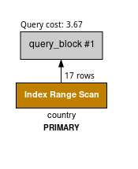
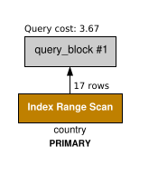

# MySQL Visual Explain CLI

[MySQL Workbench](https://github.com/mysql/mysql-workbench/) comes with a Visual Explain feature that is written in Python using [Cairo](https://www.cairographics.org/). This project simply extracts that code and provides a minimalist CLI for it.

Since Cairo supports both PNG and SVG, with only a few line changes, I was able to add support for SVG. However, due to the fact that underlying code vectorizes input text, the SVG output is generally larger than PNG output.

## Usages

### Install

Provided releases are [Python 3 zipapp](https://docs.python.org/3/library/zipapp.html).

```sh
sudo apt-get install python3-cairocffi

curl -L https://github.com/leonyu/mysql-visual-explain-cli/releases/latest/download/mysql_visual_explain_cli.pyz -o ./mysql_visual_explain_cli
chmod +x ./mysql_visual_explain_cli
```

### Convert JSON Explain file to PNG/SVG

```sh
./mysql_visual_explain_cli explain.json explain.png
./mysql_visual_explain_cli explain.json explain.svg
```

### Pipe EXPLAIN Output from MySQL

```sh
mysql --raw --skip-column-names -e "EXPLAIN FORMAT=JSON SELECT * FROM INFORMATION_SCHEMA.COLUMNS;" | ./mysql_visual_explain_cli - columns_explained.png
```

## Example Outputs

| PNG                                   | SVG                                   |
| ------------------------------------- | ------------------------------------- |
|  |  |

## Notes

The MySQL Workbench Python code calls Cairo C ABI via [SWIG](https://en.wikipedia.org/wiki/SWIG) bindings, thus this project depends on [CairoCFFI](https://pypi.org/project/cairocffi/) which provides a similar facility via [FFI](https://en.wikipedia.org/wiki/Foreign_function_interface).

MySQL Workbench uses [Swig typemap to wrap some C functions](https://github.com/mysql/mysql-workbench/blob/8.0/library/forms/swig/cairo.i) so the function signatures exposed are more Pythonic. Those wrapped functions with different APIs include `cairo.cairo_text_extents()` and `cairo.cairo_set_dash()`. The Swig typemap also performed `str` to `byte` conversion for the Python code. These changes have to be unpatched in this project.

## License

This project is a derivative work of MySQL Workbench which is GPLv2. Meaning unless I have money for a lawyer, it will forever be GPLv2 as well.
